# 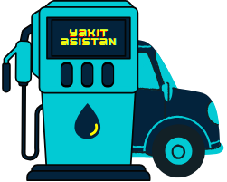 ***Yakıt Asistan***

 

<b>-> Yakıt asistanınız artık cebinizide...Asistanınızla artık işler daha kolay...İster çevrimiçi ister çevrimdışı...</b>
  

<b>Yakıt asistan nedir?</b>  
<b>-></b> Yakıt asistan uygulaması ile araçlarını ve seyahatlerini uygulamana ekleyebilirsin. 
<b>-></b> Eklediğin seyahatlerindeki mesafe ve ve harcanan yakıt miktarına göre asistanın aracının sürekli ortalama tüketimini hesaplar ve sana sunar. 
<b>-></b> Ayrıca yakıt hesaplarını artık başkalarına sormana gerek yok. Seyahatlerinin öncesinde "aracım ne kadar yakıyor, depomdaki yakıtla ne kadar yol gidebilirim, yol ne kadar tutar" gibi hesapları asistanınla artık çok kolay bir şekilde yapabilirsin. 
<b>-></b> Şehrindeki shell,opet,po,go,soil,tp vs. gibi firmaların akaryakıt fiyatlarını bir arada görüp karşılaştırabilirsin. İstersen asistan sana istediğin firmanın senin konumuna en yakıt yerdeki akaryakıt istasyonlarını listeler. 
<b>-></b> Çevrimiçi durumda üye olabilir , giriş yapabilir araç ve seyahat bilgilerini hesabında tutup istediğin cihazda giriş yapıp listeleyebilirsin. 
<b>-></b> Hem çevrimiçi hemde çevrimdışı işlemleri yapılabildiği için istediğin durumda verilerini senkronize edip eşitleyebilirsin. 
<b>-></b> Bu ve bunun gibi birçok özellik yakıt asistanla artık çebinde... 

  

<b>Akaryakıt Firmaları:</b>
 

    
    
    
    
    
    
    
    

  

<b>Uygulama tanıtım:</b>
 

    <b>Araç ekleme</b> 
    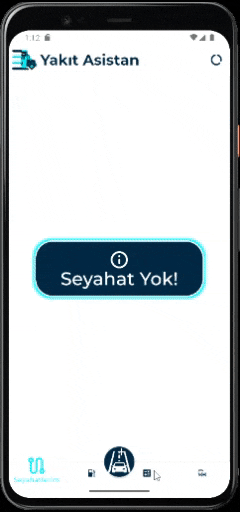  
    <b>Araçlarım</b> 
    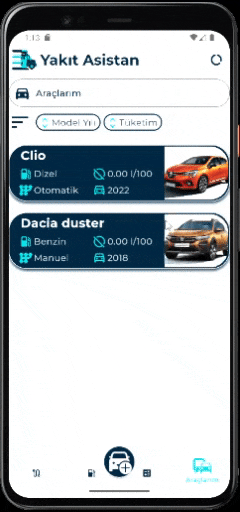  
    <b>seyahat ekleme</b> 
    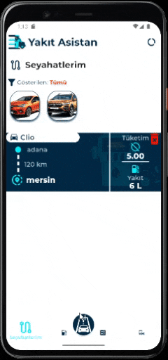  
    <b>Hesaplamalar</b> 
    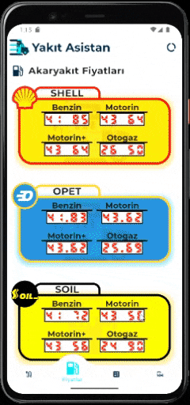  
    <b>Akaryakıt fiyatları</b> 
    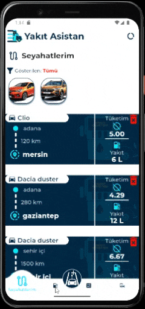  
    <b>Menü</b> 
    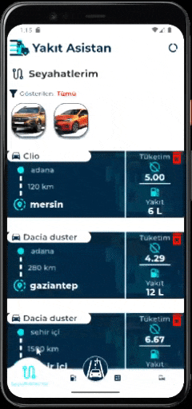  
    <b>Profil</b> 
    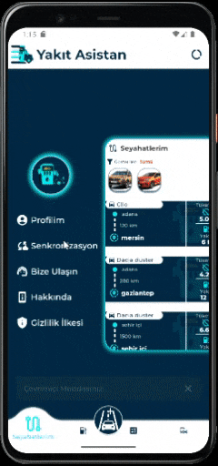  
    <b>Senkronizasyon</b> 
    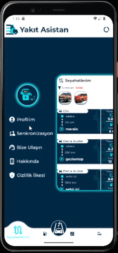  
    <b>Bize ulaşın</b> 
    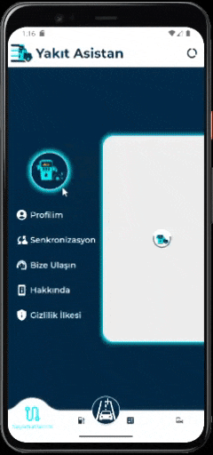  
    <b>Gizlilik politikaları</b> 
    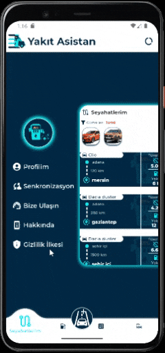

  

  

      

